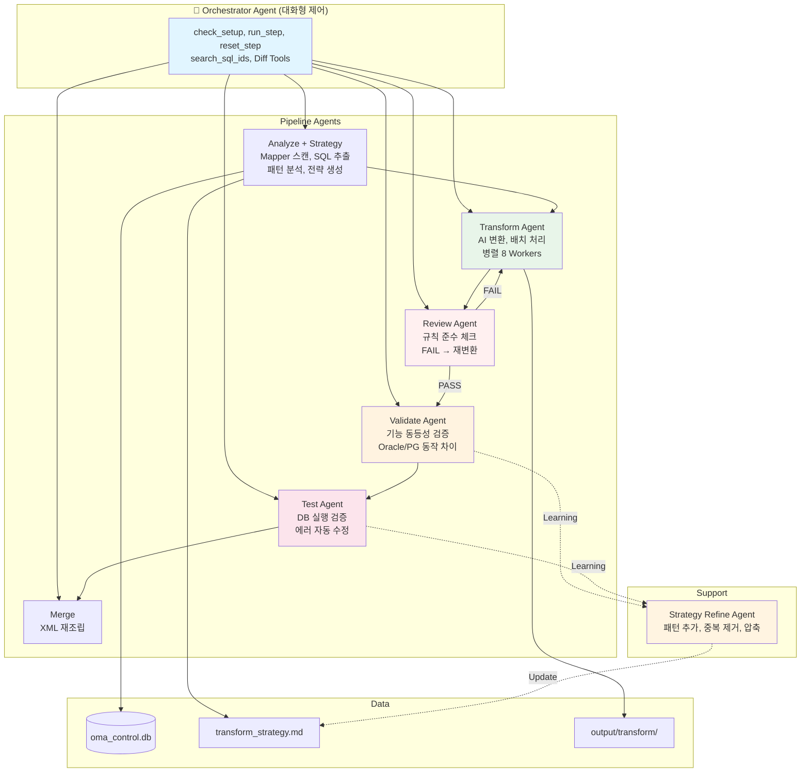

# OMA System Documentation

**Oracle Migration Assistant - 시스템 전체 문서**

**버전**: 3.1
**최종 업데이트**: 2026-02-20
**상태**: Production Ready

---

## 목차

1. [시스템 개요](#시스템-개요)
2. [아키텍처](#아키텍처)
3. [Agent 상세](#agent-상세)
4. [파이프라인 워크플로우](#파이프라인-워크플로우)
5. [전략 시스템](#전략-시스템)
6. [데이터베이스 스키마](#데이터베이스-스키마)
7. [기술 스택](#기술-스택)

---

## 시스템 개요

OMA는 Oracle SQL을 PostgreSQL로 자동 변환하는 Multi-Agent 시스템입니다.

### 핵심 특징

- 🤖 **AI 기반 자동 변환**: Claude Sonnet 4.5 (max_tokens=64000)
- 📋 **2-Tier 규칙 체계**: 정적 General Rules + 프로젝트별 동적 전략
- 🔍 **4단계 품질 보증**: Transform → Review → Validate → Test
- 🔄 **자동 수정 루프**: FAIL 시 자동 재변환
- 📚 **학습 기능**: 실패 패턴 자동 학습
- 📊 **실시간 진행률**: SQL ID별 진행 상황

---

## 아키텍처

### 시스템 구조



### 3-Block Prompt Caching

Transform, Review, Validate, Test Agent 모두 동일한 캐싱 구조:

```
Block 0: prompt.md + cachePoint          (Agent별 역할 정의)
Block 1: General Rules + cachePoint      (정적, 모든 Agent 공유)
Block 2: Project Strategy + cachePoint   (동적, 학습으로 갱신)
```

- Review Agent는 Block 0 + Block 1만 사용 (Strategy 불필요)
- Prompt Caching으로 비용 90% 절감, 캐시 유효 5분

### Agent 역할 분리

| Agent | 역할 | 관점 | 수정 여부 |
|-------|------|------|----------|
| **Transform** | Oracle → PG 변환 | "규칙 + 전문가 판단으로 변환" | SQL 생성 |
| **Review** | 규칙 준수 체크 | "규칙 다 적용했나? 잘못 적용한 건 없나?" | 안 함 (PASS/FAIL만) |
| **Validate** | 기능 동등성 | "같은 입력에 같은 결과 나오나?" | FAIL 시 수정 |
| **Test** | DB 실행 검증 | "실제로 돌아가나?" | FAIL 시 수정 |

---

## Agent 상세

### 1. Source Analyzer Agent
- **위치**: `src/agents/source_analyzer/`
- **역할**: Mapper XML 스캔, SQL ID 추출, 패턴 분석, 전략 생성
- **도구**: `file_scanner`, `sql_extractor`, `pattern_analyzer`, `strategy_generator`, `report_generator`
- **출력**: DB 등록 + `output/strategy/transform_strategy.md`

### 2. Transform Agent
- **위치**: `src/agents/sql_transform/`
- **역할**: Oracle SQL → PostgreSQL 변환
- **max_tokens**: 64000
- **도구**: `read_sql_source`, `convert_sql`, `lookup_column_type`, `split_mapper`
- **특징**: General Rules에 없는 Oracle 구문도 전문가 판단으로 변환
- **SELF-CHECK**: Oracle 잔재, XML escaping, parameter casting 확인 후 저장

### 3. Review Agent (신규)
- **위치**: `src/agents/sql_review/`
- **역할**: General Rules 준수 여부 체크 (수정하지 않음)
- **max_tokens**: 32000
- **도구**: `get_pending_reviews`, `read_sql_source`, `read_transform`, `set_reviewed`
- **체크 범위**:
  - Phase 1~4 Oracle 잔재 (40+ 함수/구문)
  - 잘못된 변환 패턴 (COALESCE+OR IS NULL, interval 오류, ROUND numeric 등)
  - Parameter casting, XML escaping, MyBatis 태그 무결성
- **FAIL 시**: Transform Agent 재호출 → 재리뷰 (최대 2라운드)
- **Signal file**: `.review_signals` (mapper|sql_id|PASS/FAIL|violations)

### 4. Validate Agent
- **위치**: `src/agents/sql_validate/`
- **역할**: 원본 Oracle SQL과 변환된 PostgreSQL SQL의 기능 동등성 검증
- **max_tokens**: 64000
- **도구**: `get_pending_validations`, `read_sql_source`, `read_transform`, `convert_sql`, `set_validated`, `lookup_column_type`
- **체크 범위**:
  - Oracle/PG 동작 차이 ('' = NULL, DECODE NULL 비교, OUTER JOIN + WHERE)
  - 컬럼 출력, 데이터 필터링, JOIN 관계, 정렬, 서브쿼리 로직
  - MyBatis 태그 무결성
- **전제 조건**: `reviewed='Y'` (Review 통과한 것만 검증)

### 5. Test Agent
- **위치**: `src/agents/sql_test/`
- **역할**: PostgreSQL DB에서 실행 테스트, 에러 수정
- **max_tokens**: 64000
- **도구**: `get_test_failures`, `read_sql_source`, `read_transform`, `convert_sql`, `run_single_test`, `lookup_column_type`
- **특징**: General Rules 참조하여 올바른 패턴으로 수정 (ad-hoc 수정 금지)

### 6. Strategy Refine Agent
- **위치**: `src/agents/strategy_refine/`
- **역할**: 전략 파일 보강/압축
- **도구**: `read_strategy`, `get_feedback_patterns`, `append_patterns`, `write_strategy`
- **규칙**: General Rules 중복 패턴은 절대 추가하지 않음

### 7. Orchestrator Agent
- **위치**: `src/agents/orchestrator/`
- **역할**: 파이프라인 제어, 사용자 대화
- **도구**: `check_setup`, `check_step_status`, `run_step`, `reset_step`, `get_summary`, `search_sql_ids`, Diff Tools
- **"실행" vs "재실행"**: "재/다시/초기화" 없으면 절대 reset 안 함

### Diff Tools (Orchestrator 도구)
- **위치**: `src/agents/orchestrator/tools/diff_tools.py`
- **역할**: SQL 비교, 승인, 리포트 (Agent가 아닌 도구 모듈)
- **도구**: 
  - `show_sql_diff`: Oracle 원본 vs PostgreSQL 변환본 Diff 표시
  - `generate_diff_report`: 전체 또는 특정 Mapper의 변환 리포트 생성 (Markdown)
  - `get_review_candidates`: 검토가 필요한 SQL 목록 조회 (필터링 가능)
  - `approve_conversion`: 변환 승인 및 리뷰 노트 기록
  - `suggest_revision`: 사용자가 제안한 수정사항 적용

### 단일 SQL 처리 도구
각 Agent는 단일 SQL 처리를 위한 전용 도구를 제공합니다:
- **Transform**: `transform_single_sql` - 특정 SQL만 즉시 변환
- **Validate**: `validate_single_sql` - 특정 SQL만 검증
- **Test**: `test_and_fix_single_sql` - 특정 SQL 테스트 및 자동 수정
- **특징**: 
  - 배치 처리 없이 즉시 실행
  - Agent를 직접 생성하여 처리
  - 디버깅 및 문제 해결에 유용
  - Orchestrator를 통해 자연어로 호출 가능

---

## 파이프라인 워크플로우

### 전체 흐름

```
Setup (1회) → Analyze → Transform → Review → Validate → Test → Merge
                                      ↓ FAIL
                                   Transform 재호출
```

### 단계별 상태 전이 (DB 컬럼)

```
                transformed  reviewed  validated  tested
Analyze 후:         N           N          N         N
Transform 후:       Y           N          N         N
Review 후:          Y           Y          N         N
Validate 후:        Y           Y          Y         N
Test 후:            Y           Y          Y         Y
```

### Signal Files (진행률 추적)

| 단계 | Signal File | 형식 |
|------|------------|------|
| Transform | `.transform_signals` | `mapper\|sql_id\|notes` |
| Review | `.review_signals` | `mapper\|sql_id\|PASS/FAIL\|violations` |
| Validate | `.validate_signals` | `mapper\|sql_id\|PASS/FAIL\|notes` |
| Test | `.test_signals` | `mapper\|sql_id\|PASS` |

### Fix History

모든 수정은 `output/logs/fix_history/`에 3단 비교로 기록:
- **ORIGINAL (Oracle)**: 원본 Oracle SQL
- **BEFORE (PG)**: 수정 전 PostgreSQL SQL
- **AFTER (PG)**: 수정 후 PostgreSQL SQL

---

## 전략 시스템

### 2-Tier 구조

| Tier | 파일 | 내용 | 관리 |
|------|------|------|------|
| **Tier 1: General Rules** | `src/reference/oracle_to_postgresql_rules.md` | 모든 프로젝트 공통 규칙 | 수동 편집 |
| **Tier 2: Project Strategy** | `output/strategy/transform_strategy.md` | 프로젝트 특화 패턴 | Agent 자동 생성/학습 |

### General Rules 구조

```
Phase 1: Structural    — 스키마, 힌트, DUAL, DB Link 제거
Phase 2: Syntax        — Comma JOIN, (+) outer join, 서브쿼리 alias
Phase 3: Functions     — NVL, DECODE, SYSDATE, TO_DATE, SUBSTR, 정규식 등 (40+)
Phase 4: Advanced      — CONNECT BY, MERGE, ROWNUM, MINUS
Reference Rule         — Parameter Casting (각 Phase에서 적용)
XML Escaping           — < <= 만 escape, > >= 는 불필요
Common Wrong Conversions — 자주 발생하는 잘못된 변환 패턴 5개
```

### 전략 학습 흐름

```
Validate/Test에서 FAIL → 수정 → fix_history 기록
    ↓
Strategy Refine Agent 호출
    ↓
General Rules 중복 체크 → 중복이면 무시
    ↓
프로젝트 특화 패턴만 Before/After 형식으로 전략에 추가
    ↓
다음 Transform 실행 시 자동 적용
```

---

## 데이터베이스 스키마

### SQLite: `src/config/oma_control.db`

#### transform_target_list (핵심 테이블)
```sql
CREATE TABLE transform_target_list (
    id INTEGER PRIMARY KEY AUTOINCREMENT,
    mapper_file TEXT NOT NULL,
    sql_id TEXT NOT NULL,
    sql_type TEXT NOT NULL,
    seq_no INTEGER NOT NULL,
    namespace TEXT,
    source_file TEXT NOT NULL,
    target_file TEXT,
    transformed TEXT DEFAULT 'N',    -- Transform 완료
    reviewed TEXT DEFAULT 'N',       -- Review 완료 (Y=PASS, F=FAIL, N=미리뷰)
    validated TEXT DEFAULT 'N',      -- Validate 완료
    tested TEXT DEFAULT 'N',         -- Test 완료
    completed TEXT DEFAULT 'N',
    created_at TIMESTAMP DEFAULT CURRENT_TIMESTAMP,
    updated_at TIMESTAMP DEFAULT CURRENT_TIMESTAMP
);
```

#### 기타 테이블
- **properties**: 환경 설정 (Java 경로, DB 접속 정보)
- **source_xml_list**: Mapper XML 파일 목록
- **pg_metadata**: PostgreSQL 컬럼 메타데이터 (타입 캐스팅용)

---

## 기술 스택

| 구분 | 기술 |
|------|------|
| **Framework** | [Strands Agents SDK](https://github.com/strands-agents/sdk-python) v1.24.0+ |
| **Model** | Claude Sonnet 4.5 (AWS Bedrock, cross-region inference) |
| **Prompt Caching** | 3-Block: prompt + General Rules + Strategy |
| **DB** | SQLite (상태 관리), PostgreSQL (타겟 DB) |
| **외부 연동** | AWS Bedrock, Java MyBatis |
| **병렬 처리** | ThreadPoolExecutor (8 workers) |
| **진행률** | Signal files + progress log tailing |
| **Python** | 3.10+ (권장 3.11) |
| **Dependencies** | boto3, defusedxml |

---

## 문제 해결

### 일반적인 문제

| 문제 | 원인 | 해결 |
|------|------|------|
| Transform 실패 | 전략 파일 없음 | `python3 src/run_source_analyzer.py` |
| Validate 에러 | reviewed 컬럼 없음 | Review 단계를 먼저 실행 (자동 생성) |
| Test 실패 | PostgreSQL 접속 불가 | `run_setup.py`로 접속 정보 재설정 |
| 전략 파일 비대 | 학습 항목 누적 | `python3 src/run_strategy.py --task compact_strategy` |
| "실행"인데 리셋됨 | Orchestrator 혼동 | "수행해줘" (이어서) vs "재수행해줘" (초기화) |

### 로그 위치
```
output/logs/
├── transform/[Mapper].log    # 변환 상세
├── review/[Mapper].log       # 리뷰 PASS/FAIL + violations
├── validate/[Mapper].log     # 검증 상세
├── test/[Mapper].log         # 테스트 상세
└── fix_history/              # 수정 이력 (ORIGINAL/BEFORE/AFTER)
```

---

**문서 버전**: 3.1
**마지막 업데이트**: 2026-02-20
